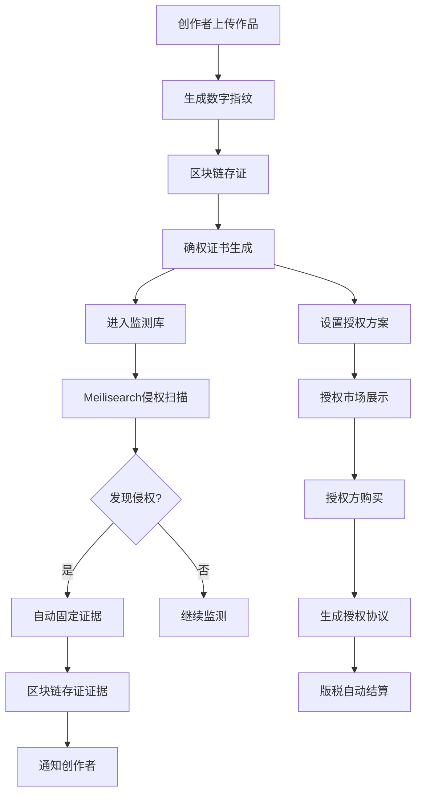

## 1. 产品概述

数字版权区块链确权与维权系统，为音乐、视频、文字作品提供区块链存证服务，实现版权自动确权、侵权行为全网监测、维权证据固定，支持版权授权交易与版税自动结算，采用Meilisearch高性能搜索引擎完成侵权内容秒级检索，全方位保护创作者数字资产。

- 目标用户：音乐人、视频创作者、作家、出版商等数字内容创作者
- 核心价值：零人工审批、全自动化版权确权与维权，降低维权成本，保障创作者权益

## 2. 核心功能

### 2.1 用户角色

| 角色 | 注册方式 | 核心权限 |
|------|----------|----------|
| 创作者 | 系统自动创建 | 登记作品、查看确权、监测侵权、管理授权、查看版税 |
| 授权方 | 系统自动创建 | 浏览授权市场、购买授权、查看版税支出 |

### 2.2 功能模块

1. **系统首页（仪表盘）**：数据概览、最近活动、快捷操作入口
2. **作品登记页**：上传作品、填写元数据、自动确权上链
3. **我的作品页**：已登记作品列表、确权状态、区块链凭证
4. **侵权监测页**：侵权扫描结果、侵权详情、风险等级
5. **证据中心页**：证据固定记录、时间戳证明、区块链存证
6. **授权交易页**：授权市场、我的授权、授权详情
7. **版税结算页**：版税收入/支出记录、自动结算明细

### 2.3 页面详情

| 页面名称 | 模块名称 | 功能描述 |
|----------|----------|----------|
| 系统首页 | 数据概览 | 显示已登记作品数、侵权监测数、授权交易数、版税总额 |
| 系统首页 | 最近活动 | 展示最近的版权登记、侵权预警、授权交易动态 |
| 系统首页 | 快捷操作 | 一键登记作品、发起侵权扫描、查看版税报告 |
| 作品登记页 | 作品上传 | 支持音乐、视频、文字作品上传与元数据填写 |
| 作品登记页 | 自动确权 | 提交后自动生成数字指纹、区块链存证、确权证书 |
| 我的作品页 | 作品列表 | 分类展示已登记作品，支持搜索和筛选 |
| 我的作品页 | 确权详情 | 区块链交易哈希、存证时间、数字指纹验证 |
| 侵权监测页 | 监测总览 | 侵权风险分布、高危侵权统计、监测状态 |
| 侵权监测页 | 侵权列表 | 侵权匹配结果、相似度、来源URL、发现时间 |
| 证据中心页 | 证据列表 | 已固定的侵权证据、证据状态、区块链存证状态 |
| 证据中心页 | 证据详情 | 侵权截图、时间戳、数字签名、区块链凭证 |
| 授权交易页 | 授权市场 | 可授权作品浏览、授权类型（独家/非独家）、价格 |
| 授权交易页 | 我的授权 | 已购授权、已售授权、授权期限与范围 |
| 版税结算页 | 收入明细 | 按作品、时间段统计版税收入 |
| 版税结算页 | 结算记录 | 自动结算状态、结算时间、转账详情 |

## 3. 核心流程

**版权确权流程**：创作者上传作品 → 系统生成数字指纹（SHA-256哈希）→ 自动写入区块链（模拟）→ 生成确权证书 → 作品进入监测库

**侵权监测流程**：定时扫描 → Meilisearch全文检索匹配 → 计算相似度 → 标记风险等级 → 自动固定证据

**维权证据固定流程**：发现侵权 → 自动截取侵权内容 → 生成时间戳 → 区块链存证 → 出具电子证据

**授权交易流程**：创作者设置授权 → 授权方浏览市场 → 购买授权 → 自动生成授权协议 → 版税自动结算

**版税结算流程**：授权交易完成 → 系统自动计算版税 → 扣除平台服务费 → 记录结算明细 → 更新账户余额

## 4. 用户界面设计

### 4.1 设计风格

- 主色调：深青蓝（#0F766E）搭配金色（#D97706）强调色，传达专业与信任感
- 辅助色：深灰（#1E293B）背景、浅灰（#F8FAFC）卡片、翡翠绿（#10B981）成功状态
- 按钮风格：圆角（8px）、填充式主按钮、描边式次按钮
- 字体：Noto Sans SC（中文UI字体），搭配 JetBrains Mono（数据/哈希展示）
- 布局风格：左侧导航栏 + 右侧内容区，卡片式布局
- 图标风格：线条式图标（Lucide Icons）

### 4.2 页面设计概览

| 页面名称 | 模块名称 | UI元素 |
|----------|----------|--------|
| 系统首页 | 数据概览 | 4个统计卡片（深色渐变背景、大号数字、趋势箭头） |
| 系统首页 | 最近活动 | 时间线列表（左侧时间轴、右侧内容卡片） |
| 系统首页 | 快捷操作 | 3个操作按钮（带图标、悬停动画） |
| 作品登记页 | 作品上传 | 表单卡片（输入框、下拉选择、文件上传区域、拖拽上传） |
| 作品登记页 | 确权进度 | 步骤条（3步骤：上传→确权→完成） |
| 我的作品页 | 作品列表 | 表格+卡片切换视图（缩略图、标题、类型标签、状态徽章） |
| 侵权监测页 | 监测总览 | 环形图+柱状图（风险分布、趋势变化） |
| 侵权监测页 | 侵权列表 | 卡片列表（相似度进度条、来源链接、风险标签） |
| 证据中心页 | 证据列表 | 表格（证据编号、关联作品、固定时间、状态） |
| 授权交易页 | 授权市场 | 网格卡片（作品封面、名称、授权类型、价格） |
| 版税结算页 | 收入明细 | 数据表格+汇总卡片（收入/支出/净额） |

### 4.3 响应式设计

- 桌面优先设计，最小宽度1024px
- 平板端：侧边栏折叠为图标模式
- 移动端：侧边栏变为底部导航，卡片单列排列
