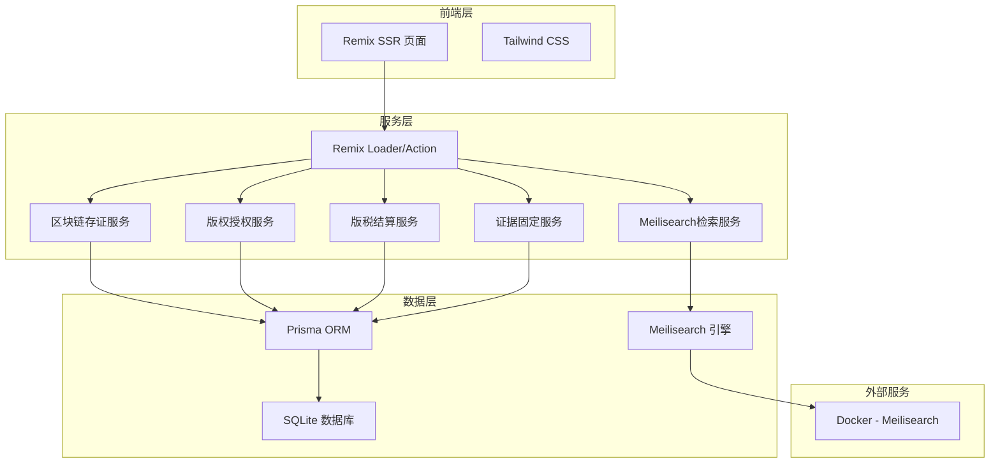
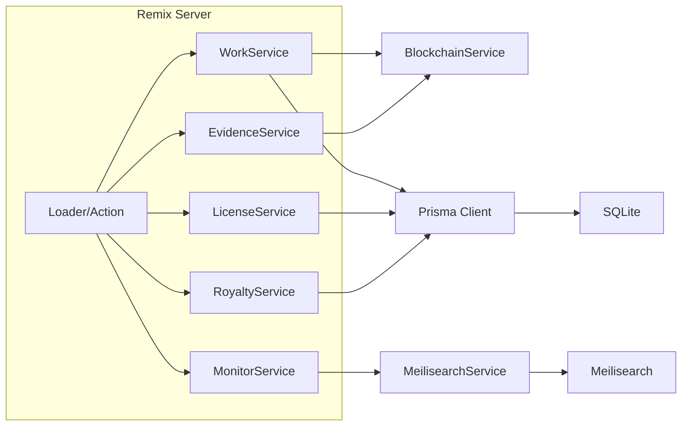
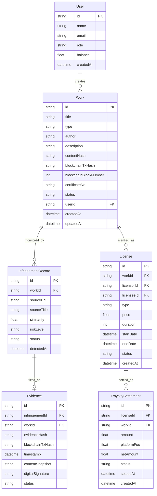

## 1. 架构设计



## 2. 技术说明

- 前端框架：Remix@2 + React@18 + TailwindCSS@3
- 构建工具：Vite（Remix Vite模式）
- 后端：Remix Server（内嵌Express适配器）
- ORM：Prisma@5
- 数据库：SQLite
- 搜索引擎：Meilisearch（Docker部署）
- 语言：TypeScript
- 运行时：Node.js

## 3. 路由定义

| 路由 | 用途 |
|------|------|
| / | 系统首页/仪表盘 |
| /register | 作品登记页 |
| /works | 我的作品列表 |
| /works/:id | 作品详情/确权信息 |
| /monitor | 侵权监测总览 |
| /evidence | 证据中心 |
| /evidence/:id | 证据详情 |
| /license | 授权交易市场 |
| /license/:id | 授权详情 |
| /royalty | 版税结算 |

## 4. API定义

### 4.1 作品相关

```typescript
type WorkType = "MUSIC" | "VIDEO" | "TEXT"

interface Work {
  id: string
  title: string
  type: WorkType
  author: string
  description: string
  contentHash: string
  blockchainTxHash: string | null
  blockchainBlockNumber: number | null
  certificateNo: string | null
  status: "PENDING" | "CONFIRMED" | "REJECTED"
  createdAt: string
  updatedAt: string
}

interface CreateWorkRequest {
  title: string
  type: WorkType
  author: string
  description: string
  content: string
}

interface CreateWorkResponse {
  work: Work
  certificate: {
    certificateNo: string
    contentHash: string
    blockchainTxHash: string
    timestamp: string
  }
}
```

### 4.2 侵权监测相关

```typescript
interface InfringementRecord {
  id: string
  workId: string
  sourceUrl: string
  sourceTitle: string
  similarity: number
  riskLevel: "HIGH" | "MEDIUM" | "LOW"
  status: "DETECTED" | "EVIDENCE_FIXED" | "ACTION_TAKEN"
  detectedAt: string
}

interface InfringementScanResult {
  totalScanned: number
  newInfringements: number
  results: InfringementRecord[]
}
```

### 4.3 证据相关

```typescript
interface Evidence {
  id: string
  infringementId: string
  workId: string
  evidenceHash: string
  blockchainTxHash: string
  timestamp: string
  contentSnapshot: string
  digitalSignature: string
  status: "FIXED" | "CHAIN_CONFIRMED"
}
```

### 4.4 授权交易相关

```typescript
type LicenseType = "EXCLUSIVE" | "NON_EXCLUSIVE"

interface License {
  id: string
  workId: string
  licensorId: string
  licenseeId: string
  type: LicenseType
  price: number
  duration: number
  startDate: string
  endDate: string
  status: "ACTIVE" | "EXPIRED" | "TERMINATED"
  createdAt: string
}
```

### 4.5 版税结算相关

```typescript
interface RoyaltySettlement {
  id: string
  licenseId: string
  workId: string
  amount: number
  platformFee: number
  netAmount: number
  status: "PENDING" | "SETTLED"
  settledAt: string | null
  createdAt: string
}
```

## 5. 服务架构图



## 6. 数据模型

### 6.1 数据模型定义



### 6.2 数据定义语言

```sql
CREATE TABLE User (
  id TEXT PRIMARY KEY,
  name TEXT NOT NULL,
  email TEXT NOT NULL UNIQUE,
  role TEXT NOT NULL DEFAULT 'CREATOR',
  balance REAL NOT NULL DEFAULT 0,
  createdAt DATETIME NOT NULL DEFAULT CURRENT_TIMESTAMP
);

CREATE TABLE Work (
  id TEXT PRIMARY KEY,
  title TEXT NOT NULL,
  type TEXT NOT NULL,
  author TEXT NOT NULL,
  description TEXT NOT NULL DEFAULT '',
  contentHash TEXT NOT NULL,
  blockchainTxHash TEXT,
  blockchainBlockNumber INTEGER,
  certificateNo TEXT,
  status TEXT NOT NULL DEFAULT 'PENDING',
  userId TEXT NOT NULL REFERENCES User(id),
  createdAt DATETIME NOT NULL DEFAULT CURRENT_TIMESTAMP,
  updatedAt DATETIME NOT NULL DEFAULT CURRENT_TIMESTAMP
);

CREATE TABLE InfringementRecord (
  id TEXT PRIMARY KEY,
  workId TEXT NOT NULL REFERENCES Work(id),
  sourceUrl TEXT NOT NULL,
  sourceTitle TEXT NOT NULL,
  similarity REAL NOT NULL,
  riskLevel TEXT NOT NULL,
  status TEXT NOT NULL DEFAULT 'DETECTED',
  detectedAt DATETIME NOT NULL DEFAULT CURRENT_TIMESTAMP
);

CREATE TABLE Evidence (
  id TEXT PRIMARY KEY,
  infringementId TEXT NOT NULL REFERENCES InfringementRecord(id),
  workId TEXT NOT NULL REFERENCES Work(id),
  evidenceHash TEXT NOT NULL,
  blockchainTxHash TEXT NOT NULL,
  timestamp DATETIME NOT NULL,
  contentSnapshot TEXT NOT NULL,
  digitalSignature TEXT NOT NULL,
  status TEXT NOT NULL DEFAULT 'FIXED'
);

CREATE TABLE License (
  id TEXT PRIMARY KEY,
  workId TEXT NOT NULL REFERENCES Work(id),
  licensorId TEXT NOT NULL REFERENCES User(id),
  licenseeId TEXT NOT NULL REFERENCES User(id),
  type TEXT NOT NULL,
  price REAL NOT NULL,
  duration INTEGER NOT NULL,
  startDate DATETIME NOT NULL,
  endDate DATETIME NOT NULL,
  status TEXT NOT NULL DEFAULT 'ACTIVE',
  createdAt DATETIME NOT NULL DEFAULT CURRENT_TIMESTAMP
);

CREATE TABLE RoyaltySettlement (
  id TEXT PRIMARY KEY,
  licenseId TEXT NOT NULL REFERENCES License(id),
  workId TEXT NOT NULL REFERENCES Work(id),
  amount REAL NOT NULL,
  platformFee REAL NOT NULL,
  netAmount REAL NOT NULL,
  status TEXT NOT NULL DEFAULT 'PENDING',
  settledAt DATETIME,
  createdAt DATETIME NOT NULL DEFAULT CURRENT_TIMESTAMP
);

CREATE INDEX idx_work_userId ON Work(userId);
CREATE INDEX idx_work_status ON Work(status);
CREATE INDEX idx_infringement_workId ON InfringementRecord(workId);
CREATE INDEX idx_evidence_workId ON Evidence(workId);
CREATE INDEX idx_license_workId ON License(workId);
CREATE INDEX idx_royalty_licenseId ON RoyaltySettlement(licenseId);
```
